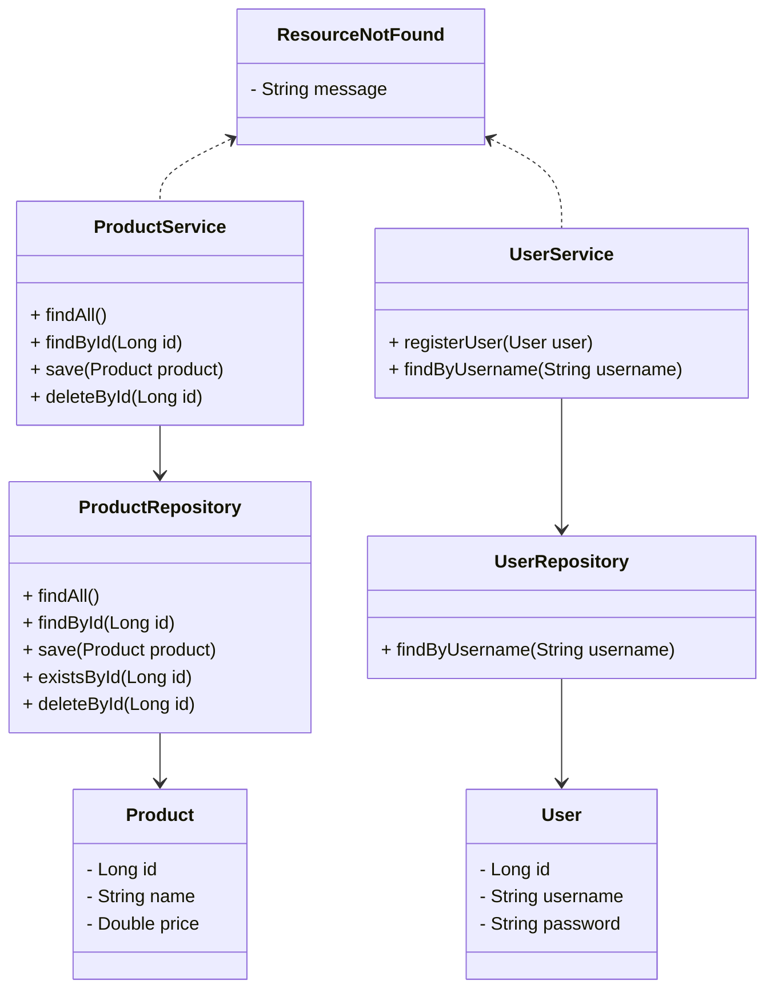

# API de Produtos e Autenticação com Spring Boot

### Descrição

Este projeto é uma API RESTful para gerenciamento de produtos (CRUD - Create, Read, Update, Delete) com um sistema de autenticação de usuários baseado em JWT (JSON Web Token). A aplicação foi desenvolvida utilizando o framework Spring Boot e se conecta a um banco de dados PostgreSQL.

**Funcionalidades Principais:**
* Gerenciamento de produtos: listar todos os produtos, buscar por ID, adicionar e excluir produtos.
* Autenticação de usuários: registro e login.
* Segurança: Endpoints protegidos por autenticação JWT.

**Tecnologias Utilizadas:**
* **Spring Boot**: Framework principal para a aplicação.
* **Spring Data JPA**: Para a camada de persistência com o banco de dados.
* **Spring Security**: Para a segurança da aplicação, incluindo a autenticação.
* **JJWT (Java JWT)**: Para a geração e validação dos tokens de autenticação.
* **PostgreSQL**: Banco de dados relacional utilizado para armazenar os dados de produtos e usuários.
* **Maven**: Ferramenta de gerenciamento de dependências e construção do projeto.

### Diagrama de Classes Simplificado

### Como Utilizar Localmente

1.  **Pré-requisitos:**
    * Java JDK 17 ou superior.
    * Maven.
    * PostgreSQL instalado e em execução.

2.  **Configuração do Banco de Dados:**
    * Crie um banco de dados chamado `bancoproducts` no seu servidor PostgreSQL.
    * O nome de usuário do banco de dados deve ser `admin` e a senha `admin`, conforme a configuração no arquivo `src/main/resources/application.properties`.
    * Caso deseje utilizar outras credenciais, modifique o arquivo `application.properties`.

3.  **Executar a Aplicação:**
    * Abra um terminal na raiz do projeto.
    * Execute o comando abaixo para iniciar a aplicação:
        * No Linux/macOS: `./mvnw spring-boot:run`
        * No Windows: `mvnw.cmd spring-boot:run`
    * A aplicação será iniciada e estará acessível em `http://localhost:8080`.

4.  **Endpoints da API:**
    * **Autenticação (endpoints públicos):**
        * `POST /auth/register`: Para registrar um novo usuário.
        * `POST /auth/login`: Para fazer login e obter um token JWT.
    * **Produtos (endpoints protegidos):**
        * `GET /api/products`: Listar todos os produtos.
        * `GET /api/products/{id}`: Buscar um produto por ID.
        * `POST /api/products`: Salvar um novo produto.
        * `DELETE /api/products/{id}`: Excluir um produto por ID.

### Contate-me

-   💼 LinkedIn: [Bruno Henrique de Godoy](https://www.linkedin.com/in/brunogodoydev/)
-   💻 GitHub: [brunogodoy2911](https://github.com/Brunogodoy2911)
-   🌐 Portfólio: [Acesse meu portfólio](https://brunogodoydev.vercel.app/)
